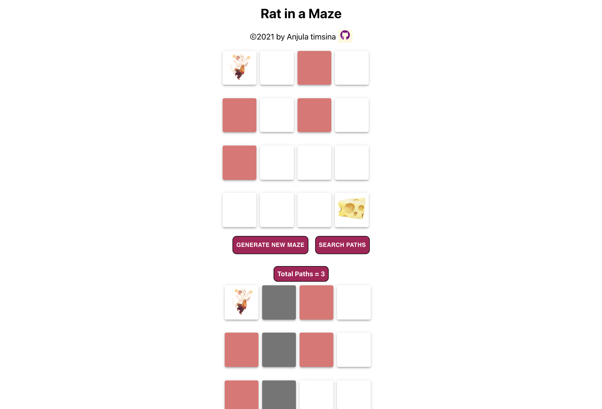

## Maze Game

This is the maze game created using react app and styled with material ui.
Maze with 4\*4 gird is created which have rat in first left cell and have cheese in last right cell. There is two buttons one generate the maze and another search for the possible routes to the cheese. Rat can move only in two direction first forward if not then only downward direction. Push, pop, recursion, backtracking, dynamic programming concept etc are used in this app.

## Technologies used

- Reactjs
- ReactIcon
- Material UI

## Screenshot

## Sources

- [Reactjs documentation](https://reactjs.org/tutorial/tutorial.html)
- [Material UI](https://mui.com/getting-started/usage/)

## Authors and acknowledgment

Anjula Timsina

- [GitHub](https://github.com/meanjula)
- [linkedIn](https://www.linkedin.com/in/meanjula/)
